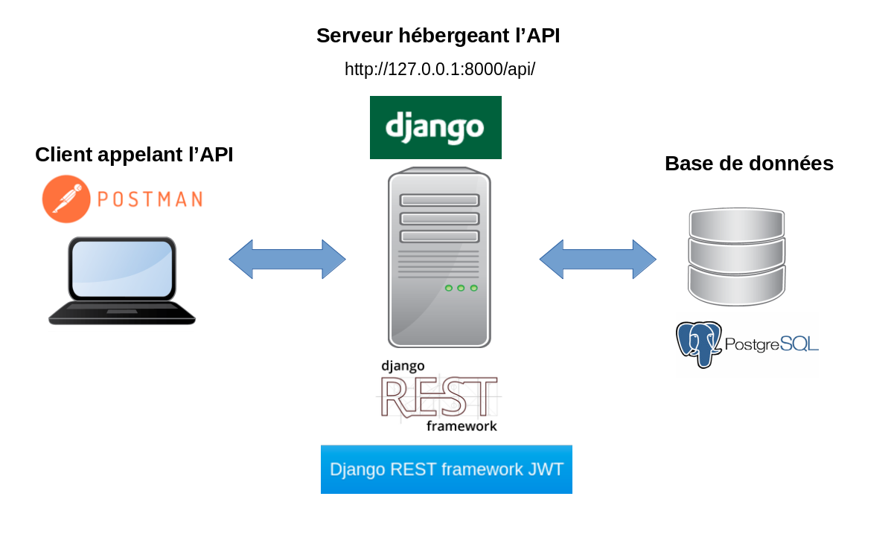
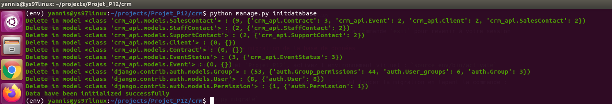
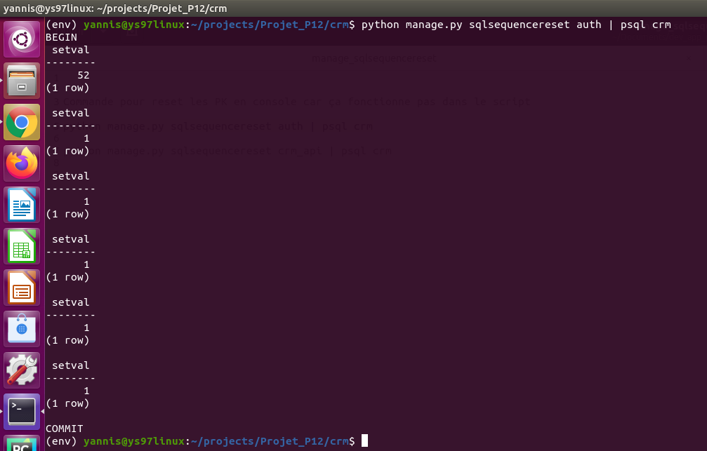
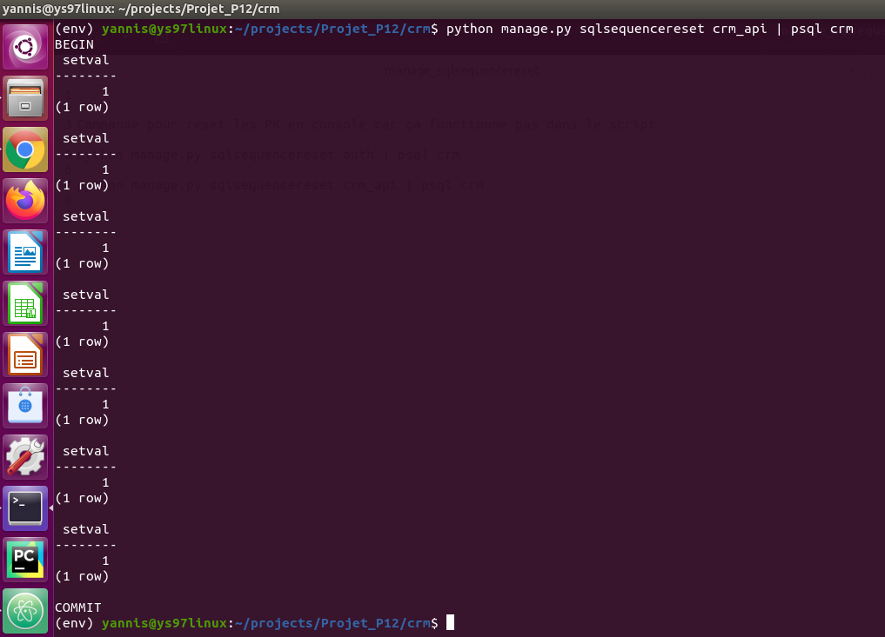
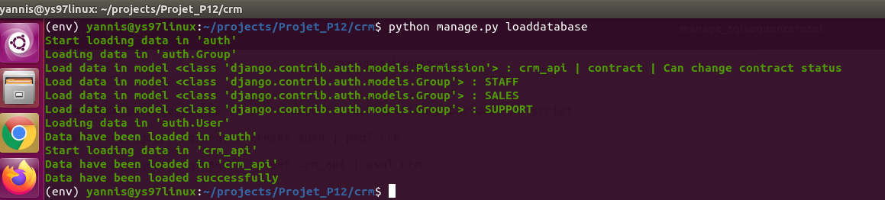
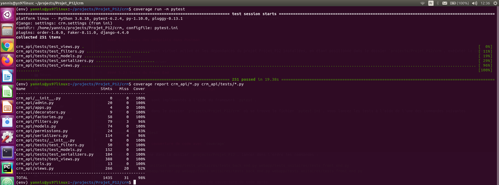
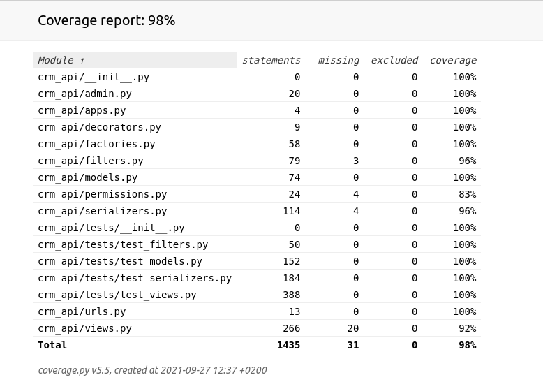

# Projet_P12
## Développez une architecture back-end sécurisée en utilisant Django ORM

### 1) Description de l'application

Ce projet consiste à créer une API REST sécurisée pour un système CRM interne à l'entreprise EPIC Events à l'aide de :
- Django
- Django REST framework
- Django REST framwework JWT (JSON Web Token)
- PostgresSQL comme système de gestion de base de données relationnelle

#### 1.1) Organisation du projet

A la racine du projet, on trouve :
- un package `crm_api`contenant le code de l'API
- un fichier `pytest.ini` avec les paramètres de configuration de Pytest

Le package `crm_api` contient les packages et modules habituels (`migrations`, `admin.py`, `apps.py`, `models.py`, etc... ) mais aussi:
- un dossier `fixtures` avec les instantanés de la bases de données au format JSON
- un dossier `logs` avec les fichiers de log du site
- un package `management` à l'intérieur duquel se trouve un package `commands` avec 2 comandes d'administration utilisant Django ORM :
    - `initdatabase` : pour supprimer le contenu des tables de l'application
    - `loaddatabase` : pour charger les données initiales dans la base de données
- un fichier `decorators.py` avec un décorateur customisé
- un fichier `factories.py` utilisé pour tester les serializers
- un fichier `filters.py` avec des "filter_backends" spécifiques à chacune des vues
- un fichier `permissions.py` dans lequel sont gérées les permissions de niveau objet de la vue "Contract"
- un fichier `serializers.py` contenant les définitions des sérializers

#### 1.2) GitFlow du projet

Le projet est organisé en 2 branches :

- `p12_dev` : branche de développement
- `main` : branche principale

### 2) Installation du projet Projet_P12 sur votre machine

Sur votre poste de travail, créer un dossier dans lequel vous allez installer le projet.

On nommera par exemple ce dossier `projects`. (vous pouvez le nommer autrement, c'est juste pour avoir une référence dans la suite des explications)

Aller sur le dépôt github : https://github.com/yannis971/Projet_P12

Pour l'installation, il y a 2 méthodes possibles.

#### 2.1) Première méthode : Téléchargement du fichier zip

Dans l'onglet **<> Code** de la page mentionnée plus haut, cliquer sur le bouton **Code** puis sur **Download ZIP**

Placer le fichier zip dans le dossier `projects` et le dézipper.

Ouvrir un terminal et se déplacer dans la racine du projet dossier `projects/Projet_P12-main/`

Passer à l'étape 3 pour configurer l'environnement virtuel

#### 2.2) Deuxième méthode : Clonage du dépôt avec git

Copier le lien https : https://github.com/yannis971/Projet_P12.git

Ouvrir un terminal et se déplacer dans le dossier `projects` créé précédemment et taper la commande :

`git clone` suivi du lien https copié plus haut.

soit : `git clone https://github.com/yannis971/Projet_P12.git`

Se déplacer dans la racine du projet : dossier `projects/Projet_P12`

Passer à l'étape 3 pour configurer l'environnement virtuel

### 3) Configuration de l'environnement virtuel

#### Remarque

Les commandes ci-dessous (notamment celles concernant l'installation de pip pour python3) sont valables sur un système d'exploitation Linux de type Debian ou de ses dérivés.

Pour Windows, on utilise python et pip.

Pour Mac OS, on utilise python3 et pip3.

#### 3.1) Installer pip pour python3 si ce n'est pas déjà fait

Si la commande `pip3 --version` renvoie une erreur alors il convient d'installer pip

`sudo apt-get update && sudo apt-get install python3-pip`

Si l'installation a réussi, la commande vous renverra une ligne comme indiqué ci-dessous

`pip 20.2.3 from /soft_desk/yannis/.local/lib/python3.8/site-packages/pip (python 3.8)`

#### 3.2) Créer un environnement virtuel et l'activer

Se placer à la racine du projet (dossier `projects/Projet_P12`) et lancer la commande :

`python3 -m venv env`

Une fois l'environnement virtuel `env` créé, l'activer avec la commande :

`source env/bin/activate`

#### 3.3) Installer les dépendances du projet

Toujours à la racine du projet, lancer l'une des 2 commandes suivantes :

`pip3 install -r requirements.txt`

`python3 -m pip install -r requirements.txt`

Pour le système d'exploitation Windows, installer les dépendances du projet à partir du fichier `requirements_windows.txt` en éxécutant la commande :

`pip install - requirements_windows.txt`

### 4) Création et initialisation de la base de données

#### 4.1) Installation de PostgresSQL

Consulter le site officiel de PostgresSQL : https://www.postgresql.org/

Télécharger l'installateur adapté à votre système d'exploitation et installer PostgresSQL.

De nombreux tutoriels sont disponibles en faisant une recherche avec les mots clés suivants :
- installer postgresSQL sur linux
- installer postgresSQL sur mac
- installer postgresSQL sur windows

#### 4.2) Connexion au serveur PostgresSQL

Dans un Terminal, tapez la commande `sudo -i -u postgres` puis saisissez votre mot de passe utilisateur sur votre système linux  

Tapez ensuite la commande `pqsl`.

Vous êtes alors dans la console d'administration de PostgreSQL.

#### 4.3) Création de la base de données et de l'utilisateur pour la connexion

Ci-après les commandes PostgreSQL pour créer la base de données `crm` et l'utilisateur configuré dans `Projet_P12/crm/crm/settings.py` pour la connection à cette base de données.

Créer la base de données `crm` :

`CREATE DATABASE crm;`

Créer l'utilisateur `yannis` avec le mot de passe `N3wpolo6` :

`CREATE USER yannis WITH ENCRYPTED PASSWORD 'N3wpolo6';`

Donner tous les droits à l'utilisateur `yannis` sur la base de données `crm`:

Quittez PostgresSQL en tapant la commande `\q` puis la commande `exit` pour revenir à votre session

#### 4.4) Effectuer la migration de la base de données

A la racine du projet `Projet_P12`, activez l'environnement virtuel : `source env/bin/activate`

Puis, déplacez-vous dans le répertoire projet `crm` et lancer la migration en tapant la commande :

`python manage.py migrate`

#### 4.5) Initialiser la base de données

Les étapes pour initialiser la base de données

1) Supprimer le contenu des tables

`python manage.py initdatabase`

2) Réinitialiser les séquences de clés primaires des tables du domaine `auth`

`python manage.py sqlsequencereset auth | psql crm`

3) Réinitialiser les séquences de clés primaires des tables du domaine `crm_api`

`python manage.py sqlsequencereset crm_api | psql crm`

4) Charger les données initiales

`python manage.py loaddatabase`

5) Mettre à jour les "fixtures"

**Attention : mettre à jour les instantanés group.json et permission.json**

Les séquences de la table correspondant au modèle `django.contrib.contenttypes.models.ContentType` peuvent varier d'une machine à l'autre.

Cela a un impact sur la table correspondant au modèle `django.contrib.auth.models.Permission`.

Les permissions de l'application étant gérées au niveau Groupe, la table correspondant au modèle `django.contrib.auth.models.Group` est également impactée.

Il convient de mettre à jour les "fixtures" `permission.json` et `group.json` en tapant les commandes suivantes :

`python manage.py dumpdata --indent=4 'auth.Permission' > crm_api/fixtures/permission.json`

`python manage.py dumpdata --indent=4 'auth.Group' > crm_api/fixtures/group.json`

De même si vous créez d'autres utilisateurs après l'initialisation de la base de données, pensez à raffraichir l'instantané `user.json` :

`python manage.py dumpdata --indent=4 'auth.User' > crm_api/fixtures/User.json`

### 5) Exécution des tests

#### 5.1) Tests des endpoints dans Postman

Une fois l'environnement virtuel activé et les dépendances du projet Projet_P12 installées, en étant positionné dans le dossier `projects/Projet_P12/crm`, démarrez le serveur en exécutant la commande :

`python manage.py runserver`

4 collections sont à disposition dans **Postman** via les liens ci-dessous.

Collection crm_api_salescontact (parcours utilisateur d'un membre de l'équipe de vente)

https://www.getpostman.com/collections/ae5c7228fa585de1d568

Collection crm_api_supportcontact (parcours utilisateur d'un membre de l'équipe de support)

https://www.getpostman.com/collections/3184ae60abe945f426a6

Collection crm_api_staffcontact (parcours utilisateur d'un membre de l'équipe de gestion)

https://www.getpostman.com/collections/b5885f4a01afb44557a3

Collection crm_api_anonymous_user (parcours d'un utilisateur anonyme)

https://www.getpostman.com/collections/d3502376bdccd36e4f0e

#### 5.2) Tests du Front End

Démarrer le serveur (voir la commande au paragraphe 5.1).

Ouvrir dans un nagivateur web l'URL : http://127.0.0.1:8000/login/

Se connecter avec un utilisateur (superutilisateur ou utilisateur membre staff)

#### 5.2) Tests unitaires avec Pytest ou Coverage

Les tests unitaires sont implémentés à l'aide du framework `pytest`.

En étant positionné dans le dossier `projects/Projet_P12/crm` où se trouve le fichier `pytest.ini`, vous lancez les tests à l'aide de l'une des commandes suivantes

`pytest`

`coverage run -m pytest`

### 5) Mesure de la couverture de code avec `coverage`

En étant positionné dans le dossier `projects/Projet_P12/crm`, lancer dans l'ordre les commandes :

- `coverage run -m pytest`
- `coverage report crm_api/*.py crm_api/tests/*.py`

Pour générer les rapports au format HTML,

Déplacez vous alors dans le répertoire `htmlcov` et ouvrir la page `index.html` :

Les sources python peuvent être analysés en cliquant sur les liens correspondants.

### 6) Licence

Le code de ce projet est sous licence libre **GNU GPL V3**

### 7) Questions/Aide/Support

En cas de problème ou pour toute question relative à ce projet, vous pouvez me contacter via l'un des canaux suivants :

* e-mail : yannis.saliniere@gmail.com

* twitter : https://twitter.com/YSaliniere

* rubrique "issues" du projet github : https://github.com/yannis971/Projet_P12/issues
